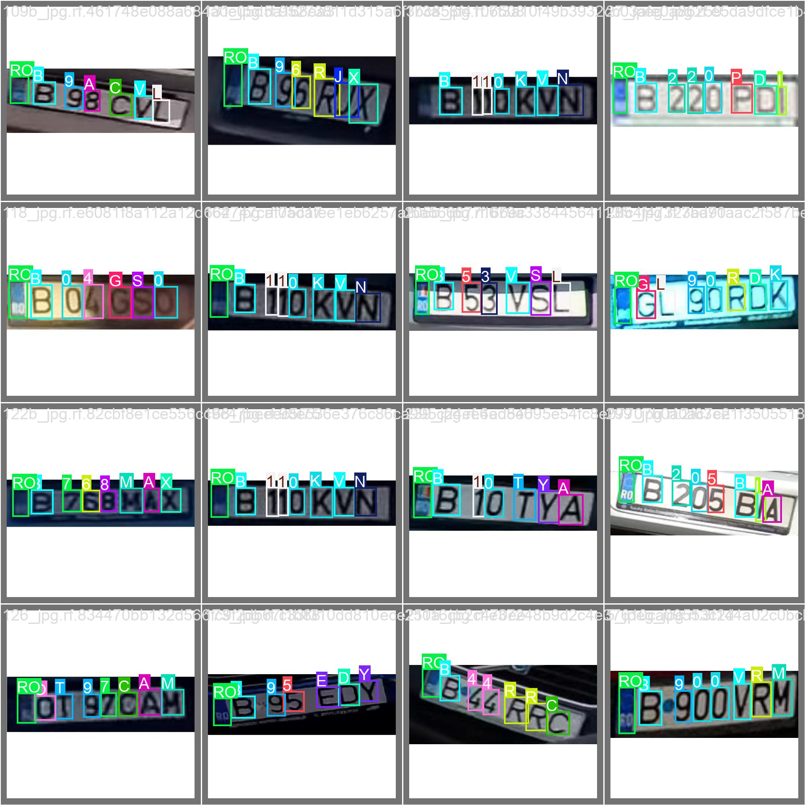
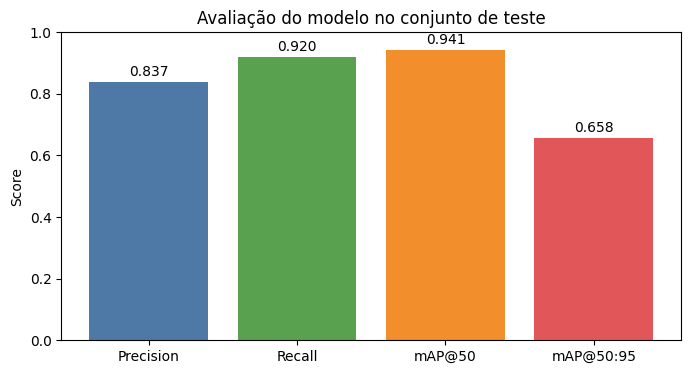
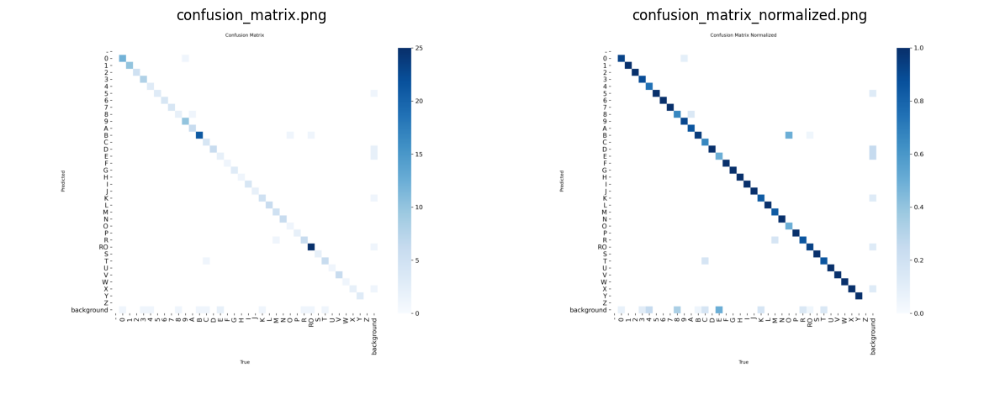
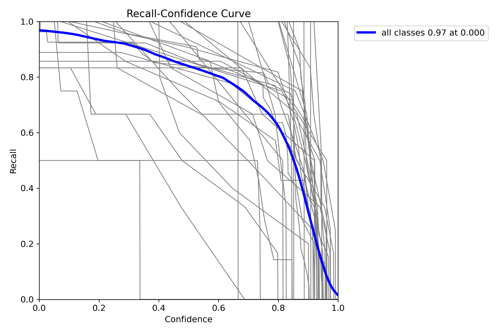

# OCR License Plate Detection

Detecção e reconhecimento óptico de caracteres em placas de licença usando YOLO (You Only Look Once). Este projeto utiliza deep learning para identificar e extrair caracteres de placas veiculares.

### Results [1/4]


### Model Avaliation [2/4]


### Matix difusion [3/4]


### Box Curve [3/4]


## 📋 Visão Geral

O projeto implementa um sistema completo de OCR para placas de licença, capaz de:
- Detectar placas em imagens
- Reconhecer caracteres individuais na placa
- Ordenar caracteres corretamente (esquerda para direita)
- Retornar o texto completo da placa

**Modelo:** `plate_recognizer.pt` (baseado em YOLO)  
**Classes:** 37 caracteres (-, 0-9, A-Z, RO)

---

## 📁 Estrutura do Projeto

```
ocr_license_plate/
├── dataset/              # Dataset de treinamento e teste
│   ├── data.yaml         # Configuração do dataset
│   ├── train/            # Imagens e rótulos de treinamento
│   ├── valid/            # Imagens e rótulos de validação
│   └── test/             # Imagens e rótulos de teste
├── model/
│   ├── plate_recognizer.pt  # Modelo treinado (peso principal)
│   └── yolo26s.pt           # Modelo alternativo
├── notebooks/
│   ├── ocr_model_train.ipynb    # Notebook de treinamento
│   └── ocr_model_test.ipynb     # Notebook de teste/inferência
├── metrics/              # Métricas e gráficos de performance
├── runs/                 # Resultados de execuções de treinamento
├── docker-compose.yml    # Configuração Docker para Jupyter
├── pyproject.toml        # Dependências do projeto
└── README.md             # Este arquivo
```

---

## 📊 Métricas de Performance

O modelo foi avaliado com as seguintes métricas disponíveis em `metrics/`:

### Curvas de Desempenho

| Métrica | Descrição |
|---------|-----------|
| **BoxF1_curve.png** | Curva F1-Score durante validação (harmônica entre precisão e recall) |
| **BoxP_curve.png** | Curva de Precisão (acurácia das detecções positivas) |
| **BoxR_curve.png** | Curva de Recall (capacidade de detectar todas as positivas) |
| **BoxPR_curve.png** | Curva Precisão-Recall |

### Matriz de Confusão

- **confusion_matrix.png**: Matriz de confusão raw
- **confusion_matrix_normalized.png**: Matriz de confusão normalizada

### Exemplos de Validação

- **val_batch0_labels.jpg**: Rótulos anotados da primeira validação
- **val_batch0_pred.jpg**: Predições do modelo (primeira batch)
- **val_batch1_labels.jpg**: Rótulos anotados da segunda validação
- **val_batch1_pred.jpg**: Predições do modelo (segunda batch)

---

## 🚀 Instalação

### Pré-requisitos
- Python >= 3.8
- pip ou conda

### Via pip

```bash
# Clone ou acesse o diretório do projeto
cd ocr_license_plate

# Instale as dependências
pip install -r requirements.txt
```

### Com Poetry (via pyproject.toml)

```bash
pip install .
```

### Com Docker (Jupyter Lab)

```bash
docker-compose up
# Acesse em http://localhost:8888
```

### Dependências Principais

```
ultralytics>=8.0.0      # Framework YOLO
opencv-python>=4.8.0    # Processamento de imagens
matplotlib>=3.7.0       # Visualização
```

---

## 💻 Como Usar

### 1. Teste Rápido com o Modelo Pré-treinado

```python
from ultralytics import YOLO
import cv2
import matplotlib.pyplot as plt

# Carregue o modelo
model = YOLO('./model/plate_recognizer.pt')

# Leia uma imagem
image = cv2.imread('path/to/image.jpg')

# Execute inferência
results = model(image)

# Processe resultados
for result in results:
    for box in result.boxes:
        x1, y1, x2, y2 = box.xyxy[0]
        confidence = box.conf[0]
        class_id = int(box.cls[0])
        class_name = model.names[class_id]
        
        print(f"Caractere: {class_name}, Confiança: {confidence:.2f}")
```

### 2. Usar o Notebook de Teste

Abra e execute [ocr_model_test.ipynb](notebooks/ocr_model_test.ipynb):

```bash
jupyter notebook notebooks/ocr_model_test.ipynb
```

O notebook inclui:
- Carregamento de imagens do dataset de teste
- Detecção de caracteres
- Ordenação esquerda-direita
- Visualização de resultados

### 3. Ordenar Boxes Esquerda-Direita

```python
def sort_boxes_left_to_right(results):
    """Ordena os boxes detectados da esquerda para direita"""
    boxes = results[0].boxes
    sorted_indices = boxes.xyxy[:, 0].argsort()
    sorted_boxes = boxes[sorted_indices]
    return {"boxes": sorted_boxes}

# Uso
result = sort_boxes_left_to_right(results)
plate_text = ''.join([model.names[int(box.cls[0])] for box in result["boxes"]])
print(f"Placa: {plate_text}")
```

### 4. Treinar Novo Modelo

Abra [ocr_model_train.ipynb](notebooks/ocr_model_train.ipynb) para recriar ou fine-tunar o modelo.

---

## 📦 Dataset

### Estrutura

O dataset está organizado em três splits:

```
dataset/
├── train/     # Imagens de treinamento
├── valid/     # Imagens de validação
└── test/      # Imagens de teste
```

Cada split contém:
- `images/` - Arquivos de imagem (.jpg, .jpeg)
- `labels/` - Arquivos de anotação YOLO (.txt)

### Classes (37 total)

- **Hífen:** `-`
- **Dígitos:** `0-9`
- **Letras:** `A-Z`
- **Especial:** `RO`

### Formato de Anotação

Arquivo `.txt` com uma linha por objeto (formato YOLO):
```
<class_id> <x_center> <y_center> <width> <height>
```

Valores em coordenadas normalizadas (0-1).

### Fonte

Dataset importado do Roboflow:
- **Projeto:** ANPR/OCR License Plate
- **Link:** https://universe.roboflow.com/anpr-8jutb/ocr-mrkbm/dataset/2
- **Licença:** MIT

---

## 🔧 Configuração Avançada

### Arquivo `data.yaml`

Define propias de treinamento:

```yaml
train: ../train/images
val: ../valid/images
test: ../test/images
nc: 37
names: ['-', '0', '1', ..., 'Z']
```

### Docker

Para usar com Jupyter Lab:

```bash
# Iniciar
docker-compose up

# Parar
docker-compose down
```

---

## 📈 Próximos Passos

1. **Melhorar acurácia:** Fine-tuning com mais dados
2. **Otimização:** Quantização do modelo para inferência em edge
3. **Integração:** API REST para inferência
4. **Pós-processamento:** Correção de caracteres com modelos de linguagem

---

## 📝 Licença

MIT

---

## 👤 Autor

Projeto de OCR para placas de licença com YOLO.

---

## 📞 Suporte

Para dúvidas ou problemas, verifique:
- `notebooks/ocr_model_test.ipynb` - Exemplos práticos
- `metrics/` - Visualizar performance do modelo
- Documentação da [Ultralytics YOLO](https://docs.ultralytics.com)
